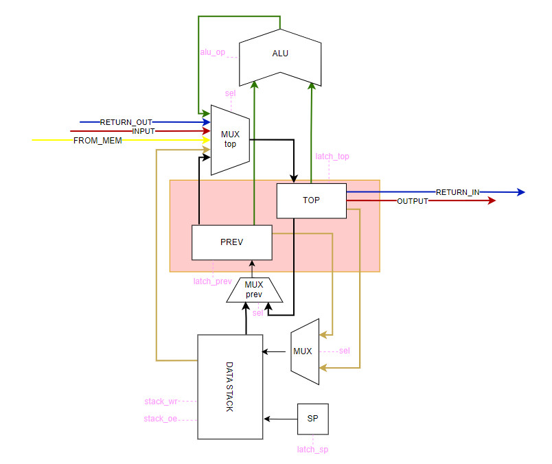
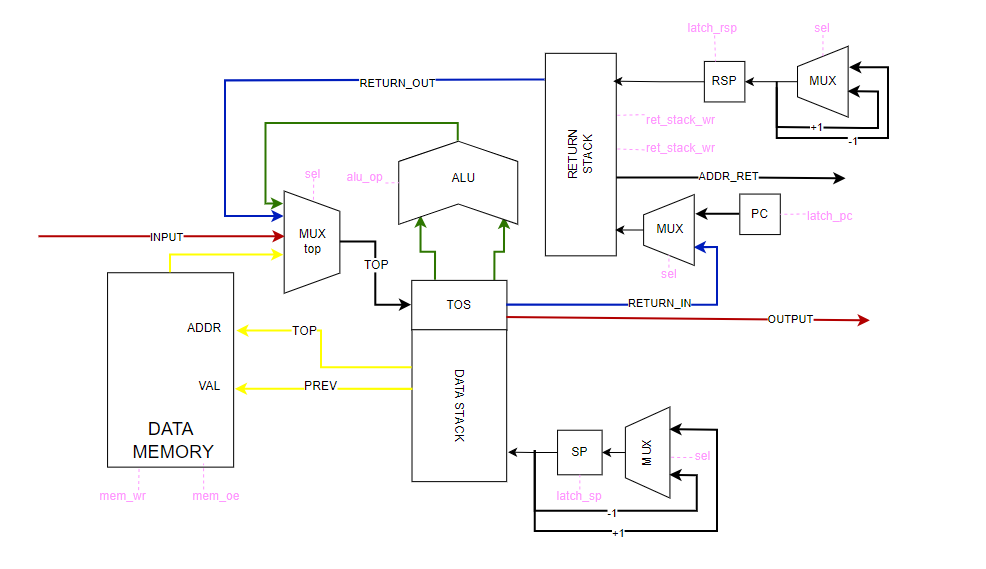
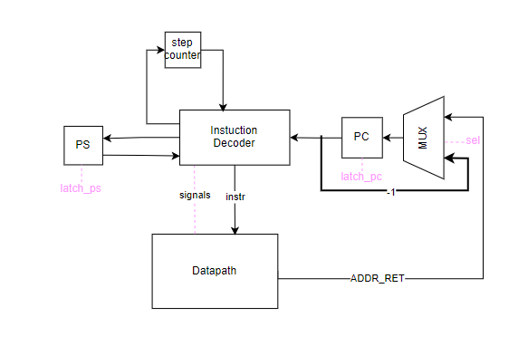

# Лабораторная работа №3. Транслятор и модель процессора

## Детали выполненной работы

### Автор

> Загородников Илья Вячеславович, P33121

### Вариант

> forth | stack | harv | hw | instr | struct | trap | port | cstr | prob2 | spi
>
> Без усложнения

## Язык программирования

### Форма Бэкуса-Наура

```ebnf

<функция> ::= ": " <название функции> <программа> " ;"

<программа> ::= <комментарии> | <пусто> | <слово> | <программа> " " <программа> | <условный оператор> |
                 | <оператор цикла begin until> | <объявление переменной>
                
<комментарии> ::= "#" <текст>
                
<объявление переменной> ::= "variable " <переменная> ["allot " <положительное число>] 

<число> ::= [-]<положительное число>

<положительное число> ::= <цифра> | <цифра> <положительное число>

<цифра> ::= "0" | "1" | "2" |  ... | "9"

<строка> ::= <символ> | <символ> <строка>

<переменная> ::= <строка>

<символ> ::= "a" | "b" | "c" | ... | "z" | "A" | "B" | "C" | ... | "Z" | <цифра>

<условный оператор> ::= if <программа> [else <программа>] then  

<оператор цикла begin until> ::= begin <программа> until  

<слово> ::= <число> | <математический оператор> | <отображение строки> | <название функции> |
            "mod" | "drop" | "swap" | "over" | "dup" | "read" | "emit" | <переменная> | "@" | "!" | "ei" | "di"

<математический оператор> ::= "+" | "-" | "*" | "/" | "=" | "<" | ">" 

<отображение строки> ::= "." <строка>

```

### Примечание

Чтобы отобразить строку, нужно написать так: ." Hello world"
Пробел перед кавычкой обязателен.

### Семантика

- Глобальная видимость данных.
- Код выполняется последовательно, кроме функций. Чтобы вызвать функцию нужно указать ее название в программе.
- Название переменной не должна иметь символы, не должна совпадать с ключевыми словами.
- Любой текст, расположенный в конце строки после символа `#` трактуется как комментарий
- Заново определить переменную нельзя.

Ниже описаны основные стековые операции в виде (стек до >> стек после).

* ```+``` - {n1 n2 >> n3}
* ```-``` - {n1 n2 >> n3}
* ```*``` - {n1 n2 >> n3}
* ```/``` - {n1 n2 >> n3}
* ```=``` - {n1 n2 >> n3} | n3 = 1 if n1 == n2 n3 = 0 if n1 != n2
* ```>``` - {n1 n2 >> n3} | n3 = 1 if n1 > n2 n3 = 0 if n1 <= n2
* ```<``` - {n1 n2 >> n3} | n3 = 1 if n1 < n2 n3 = 0 if n1 >= n2
* ```mod``` - {n1 n2 >> n3}
* ```drop``` - {n1 >> }
* ```swap``` - {n1 n2 >> n2 n1}
* ```over``` - {n1 n2 >> n1 n2 n1}
* ```dup``` - {n1 >> n1 n1} -
* ```omit``` - {n1 n2 >> } - вывести ASCII символ с кодом n1 в IO порт n2
* ```read``` - {n1 >> n2} - прочитать значение с порта n1 и положить на стек (в top)
* ```!``` - {n1 n2 >> } - записать значение n1 в ячейку памяти n2
* ```@``` - {n1 >> n2} - прочитать значение из ячейки памяти n1 и положить его на стек (в top)
* ```ei``` - { >> } - включить прерывания
* ```di``` - { >> } - отключить прерывания
* ```(num)``` - {n1 n2 >> a b (num)} - положить число на стек (top)

* `begin` <код> `until` - цикл, который выполняется до того момента, когда на вершине стека не будет положительного
  значения (любое, но не 0) по достижении `until`.
  until - берет значение с верхушки стека каждую итерацию.
* `if` <код> [`else` <код>] `then` - if берет значение со стека, если оно 0, тогда прыгает до конструкции else. Иначе
  выполняется до конструкции else, а после прыгает на then.

Оператор объявления переменной ```variable``` создаёт переменную и сопоставляет ей
определенную ячейку памяти, взаимодействовать с которой возможно при помощи ```!``` и ```@```.
В случае добавления ключевого слова ```allot``` выделяется непрерывный участок памяти с фиксированным
в программе размером.

Комментарии не предусмотрены.

Используемые литералы:

* строковые литералы - имеют вид " <строка>", используются для экранизации текста после оператора ```.```
* целочисленные литералы - являются полноценным словом в программе и необходимы для того, чтобы положить конкретное
  значение на вершину стека, диапазон значений - ```[-2^{31}, 2^{31} - 1]```

# Организация памяти

```text
            Data memory
+-----------------------------------------------+
| 00       string literals                      |
| 01       string literals                      |
|      ...                                      |
| 510      strings literal                      |
| 511      strings literal                      |
+-----------------------------------------------+
| 512      variables                            |
| 513      variables                            |
|      ...                                      |
| 14999    variables                            |
| 15000    variables                            |  
+-----------------------------------------------+


            Instruction memory
+-----------------------------------------------+
|    0    :  jmp x                              |
|    1    :  interrupt handler                  |
|        ...                                    |
|   x-1   :  interrupt handler                  |
+-----------------------------------------------+
|    x    :  program start                      |
|        ...                                    |
| 14999   :  program                            |
| 15000  ... program                            |
+-----------------------------------------------+
```

* Размер машинного слова данных -- 32 бит
* Память команд и данных раздельна (Гарвардская архитектура)
* Размер памяти неопределен (определяется при симуляции)
* Адрес 0 зарезервирован для перехода к началу программы
* Адрес 1 зарезервирован для подпрограммы обработки прерывания ввода. Доступен только один обработчик прерывания.
* Все переменные хранятся статически в памяти данных
* Процедуры хранятся последовательно в памяти.
* Используется стек возврата (отдельное физическое устройство) для хранение адресов возвратов при входе и выходе из
  подпрограмм.
* Память данных и команд выделяется статически при запуске модели
* Программисту явно доступны только стек данных и память данных.
* Из-за того, что "Статические строки должны храниться в памяти данных", строковые литералы записываются в память данных
  только во время исполнения программы. Для каждого символа происходят команды загрузки на стек и записи в память. А после этого
Последовательное чтение и вывод в порт, пока не дошли до '\0'.

## Система команд

### Цикл исполнения команды

1. Выборка инструкции (без сохранения информации в промежуточные регистры)
2. Исполнение команды (количество тактов необходимых для исполнения указано в таблице ниже)
3. Проверка на прерывание (если прерывание, сохранение PC в Return Stack, переход к обработчику прерывания)

### Набор инструкций

Набор инструкций реализован в модуле [isa.py](src/isa.py):

| Инструкция | Комментарий                                                            |
|:-----------|:-----------------------------------------------------------------------|
| mul        |                                                                        |
| div        |                                                                        |
| sub        |                                                                        |
| add        |                                                                        |
| mod        |                                                                        |
| eq         |                                                                        |
| gr         |                                                                        |
| ls         |                                                                        |
| drop       |                                                                        |
| swap       |                                                                        |
| over       |                                                                        |
| dup        |                                                                        |
| ei         | разрешить прерывания                                                   |
| di         | запретить прерывания                                                   |
| omit       |                                                                        |
| read       |                                                                        |
| store      | память данных из стека                                                 |
| load       | в стек из памяти данных                                                |
| push imm   | записать в стек непосредственное значение                              |
| pop        | перенести значение со стека данных в стек возврата                     |
| rpop       | перенести значение из стека возврата в стек данных                     |
| jmp addr   | перейти по адресу                                                      |
| zjmp addr  | перейти по адресу, если на вершине стека 0 (убирает значение со стека) |
| call addr  | вызов процедуры                                                        |
| ret        | выход из процедуры или прерывания                                      |
| halt       | завершение программы                                                   |

### Кодирование инструкций

Инструкции кодируются в формат JSON и имеют вид:

```json
 {
  "index": 231,
  "command": "push",
  "arg": 422
}
```

Аргумент опционален и его наличие зависит от команды

# Транслятор

Интерфейс командной строки: translator.py <input_file> <target_file>

Реализовано в модуле [translator.py](src/translator.py).

Этапы трансляции (функция translate):

...

# Модель процессора

Интерфейс командной строки: machine.py <machine_code_file> <input_file>

Реализовано в модуле: [machine.py](src/machine.py).

### Stack Approach:


### Datapath:


### Control Unit:


DataPath находится в классе [machine.py:DataPath](src/machine.py).

ControlUnit находится в классе [machine.py:ControlUnit](src/machine.py).

Stack Approach включен в класс [machine.py:DataPath](src/machine.py).

По ссылке доступна более полная [схема процессора](https://viewer.diagrams.net/index.html?tags=%7B%7D&highlight=0000ff&edit=_blank&layers=1&nav=1&title=CSA.drawio#Uhttps%3A%2F%2Fdrive.google.com%2Fuc%3Fid%3D12XX7sYATKXMLtYJu42ERG1WlpAibQEMV%26export%3Ddownload#%7B%22pageId%22%3A%22VrHovuQIk03kW5obrpS9%22%7D)

# Система команд:

| Инструкция                          | Последовательное выполнение процессором:                                                   | Такты |
|:------------------------------------|:-------------------------------------------------------------------------------------------|-------|
| div, sub, add, mul, mod, eq, gr, ls | 1) Top = top x prev; sp--; <br/> 2) prev = stack[sp];                                      | 2     |
| drop                                | 1) sp--;<br/> 2) Top = prev; prev = stack[sp];                                             | 1     |
| swap                                | 1) Stack[sp] = top; top = prev;<br/>2) prev = stack[sp];                                   | 2     |
| over                                | 1) stack[sp] = prev; prev = top <br/> 2) prev = stack[sp]                                  | 2     |
| dup                                 | 1) stack[sp] = prev; prev = top; sp++;                                                     | 1     |
| emit                                | 1) output[port: top] = prev; sp--;<br/> 2) top = stack[sp]; sp--;<br/> 3) prev = stack[sp] | 3     |
| load                                | Top = Data_mem[top]                                                                        | 1     |
| push                                | 1) stack[sp] = prev; prev = top; top = immediate; sp++;                                    | 1     |
| rpop                                | 1) stack[sp] = prev; prev = top; sp++; rsp—;<br/> 2) top = ret_stack[rsp];                 | 2     |
| store                               | 1) data_mem[top] = prev; sp--;<br/> 2) top = stack[sp]; sp--; <br/> 3) prev = stack[sp]    | 3     |
| pop                                 | 1) Ret_stack[rsp] = top; rsp++; sp--;<br/> 2) top = prev; prev = stack[sp]                 | 2     |
| jmp                                 | 1) PC = Immediate                                                                          | 1     |
| zjmp                                | 1) pc = immediate; sp--;<br/> 2) top = prev; prev = stack[sp]                              | 2     |
| call                                | 1) Ret_stack[rsp] = PC; PC = Immediate; rsp++;                                             | 1     |
| ret                                 | 1) rsp--; <br/>  2) pc = ret_stack[rsp]                                                    | 2     |

В таблице описываются последовательно все сигналы, которые выставляет instruction decoder. 

### Справка 
SP указывает на первую свободную ячейку.

### Имеющаяся память:

- Data Stack - стек, в котором хранятся данные программы
- Return Stack - стек, в котором хранятся адреса возврата.
- Instruction Memory - память, в которой хранятся все команды (однопортовая)
- Data Memory - память данных (однопортовая)

### Регистры (соответствуют регистрам на схеме):

- TOP
- PREV
- SP
- RSP
- PC
- PS

### Объекты:

- input_buffer -- входной буфер данных
    - номер порта = 1
- output_symbol_buffer -- выходной буфер для символов
    - номер порта = 2
- output_numeric_buffer -- выходной буфер для чисел
    - номер порта = 3
- alu -- арифметико-логическое устройство
    - сигналы на мультиплексоры реализованы в виде Enum (Selector) в модуле [machine.py](src/machine.py)
    - операции алу реализованы в виде Enum (ALUOpcode) в модуле [machine.py](src/machine.py)

## Тестирование

В качестве тестов использовано четыре алгоритма:

1. [alice](example/code/alice.forth)
2. [cat](example/code/cat.forth)
3. [hello](example/code/hello.forth)
4. [prob2](example/code/prob2.forth)

Интеграционные тесты реализованы в модуле [integration_test](src/integration_test.py) в виде golden тестов:
- Стратегия: golden tests, конфигурация в папке [golden/](./golden)

CI при помощи Github Action:

```yaml
name: Translator Model Python CI

on:
  push:
    branches:
      - master
    paths:
      - ".github/workflows/*"
      - "src/**"
  pull_request:
    branches:
      - master
    paths:
      - ".github/workflows/*"
      - "src/**"

defaults:
  run:
    working-directory: ./src

jobs:
  test:
    runs-on: ubuntu-latest
    steps:
      - name: Checkout code
        uses: actions/checkout@v4
      - name: Set up Python
        uses: actions/setup-python@v4
        with:
          python-version: 3.11
      - name: Install dependencies
        run: |
          python -m pip install --upgrade pip
          pip install poetry
          poetry install
      - name: Run tests and collect coverage
        run: |
          poetry run coverage run -m pytest .
          poetry run coverage report -m
        env:
          CI: true

  lint:
    runs-on: ubuntu-latest
    steps:
      - name: Checkout code
        uses: actions/checkout@v4
      - name: Set up Python
        uses: actions/setup-python@v4
        with:
          python-version: 3.11
      - name: Install dependencies
        run: |
          python -m pip install --upgrade pip
          pip install poetry
          poetry install
      - name: Check code formatting with Ruff
        run: poetry run ruff format --check .
      - name: Run Ruff linters
        run: poetry run ruff check .
```

где: 
- `poetry` -- управления зависимостями для языка программирования Python
- `coverage` -- формирование отчёта об уровне покрытия исходного кода
- `pytest` -- утилита для запуска тестов
- `ruff` -- утилита для форматирования и проверки стиля кодирования

Пример использования и журнал работы процессора на примере cat:
```zsh
(venv) PS C:\Users\User\PycharmProjects\CSA-LAB> cat .\input_mac.txt
[(30, 'a'), (80, 'l'), (130, 'i'),  (150, 'c'), (390, 'e'), (391, '\n')]
(venv) PS C:\Users\User\PycharmProjects\CSA-LAB> cat .\trans_in.txt                                         
    1 read
      2 emit
    then
    ei
  ;

  variable stop_input
  0 stop_input !
  begin stop_input @ until
(venv) PS C:\Users\User\PycharmProjects\CSA-LAB> python .\src\translator.py trans_in.txt trans_out.txt  
source LoC: 11 code instr: 22
(venv) PS C:\Users\User\PycharmProjects\CSA-LAB> cat .\trans_out.txt                                    
[{"index": 0, "command": "jmp", "arg": 15},
 {"index": 1, "command": "push", "arg": 1},
 {"index": 2, "command": "read"},
 {"index": 3, "command": "dup"},
 {"index": 4, "command": "push", "arg": 10},
 {"index": 5, "command": "eq"},
 {"index": 6, "command": "zjmp", "arg": 11},
 {"index": 7, "command": "push", "arg": 1},
 {"index": 8, "command": "push", "arg": 512},
 {"index": 9, "command": "store"},
 {"index": 10, "command": "jmp", "arg": 13},
 {"index": 12, "command": "emit"},
 {"index": 13, "command": "ei"},
 {"index": 14, "command": "ret"},
 {"index": 15, "command": "push", "arg": 0},
 {"index": 16, "command": "push", "arg": 512},
 {"index": 17, "command": "store"},
 {"index": 18, "command": "push", "arg": 512},
 {"index": 19, "command": "load"},
 {"index": 20, "command": "zjmp", "arg": 18},
 {"index": 21, "command": "halt"}]
(venv) PS C:\Users\User\PycharmProjects\CSA-LAB> python .\src\machine.py .\trans_out.txt .\input_mac.txt
INFO:root:MAIN | TICK:    2 | INSTR: jmp 15  | PC:  15 | PS_REQ 0 | PS_MODE: 1 | SP:   0 | RSP:   0 | DATA_MEMORY[TOP]    1111 | TOS : [4444, 4444] | RETURN_TOS : [2222, 2222, 2222]
INFO:root:MAIN | TICK:    4 | INSTR: push 0  | PC:  16 | PS_REQ 0 | PS_MODE: 1 | SP:   1 | RSP:   0 | DATA_MEMORY[TOP]    1111 | TOS : [0, 4444, 4444] | RETURN_TOS : [2222, 2222, 2222]
INFO:root:MAIN | TICK:    6 | INSTR: push 512 | PC:  17 | PS_REQ 0 | PS_MODE: 1 | SP:   2 | RSP:   0 | DATA_MEMORY[TOP]    1111 | TOS : [512, 0, 4444, 4444] | RETURN_TOS : [2222, 2222,
 2222]
INFO:root:MAIN | TICK:   10 | INSTR: store   | PC:  18 | PS_REQ 0 | PS_MODE: 1 | SP:   0 | RSP:   0 | DATA_MEMORY[TOP]    1111 | TOS : [4444, 4444] | RETURN_TOS : [2222, 2222, 2222]   
INFO:root:MAIN | TICK:   12 | INSTR: push 512 | PC:  19 | PS_REQ 0 | PS_MODE: 1 | SP:   1 | RSP:   0 | DATA_MEMORY[TOP]       0 | TOS : [512, 4444, 4444] | RETURN_TOS : [2222, 2222, 22
22]
INFO:root:MAIN | TICK:   14 | INSTR: load    | PC:  20 | PS_REQ 0 | PS_MODE: 1 | SP:   1 | RSP:   0 | DATA_MEMORY[TOP]    1111 | TOS : [0, 4444, 4444] | RETURN_TOS : [2222, 2222, 2222]
INFO:root:MAIN | TICK:   17 | INSTR: zjmp 18 | PC:  18 | PS_REQ 0 | PS_MODE: 1 | SP:   0 | RSP:   0 | DATA_MEMORY[TOP]    1111 | TOS : [4444, 4444] | RETURN_TOS : [2222, 2222, 2222]   
INFO:root:MAIN | TICK:   19 | INSTR: push 512 | PC:  19 | PS_REQ 0 | PS_MODE: 1 | SP:   1 | RSP:   0 | DATA_MEMORY[TOP]       0 | TOS : [512, 4444, 4444] | RETURN_TOS : [2222, 2222, 22
22]
INFO:root:MAIN | TICK:   21 | INSTR: load    | PC:  20 | PS_REQ 0 | PS_MODE: 1 | SP:   1 | RSP:   0 | DATA_MEMORY[TOP]    1111 | TOS : [0, 4444, 4444] | RETURN_TOS : [2222, 2222, 2222]
INFO:root:MAIN | TICK:   24 | INSTR: zjmp 18 | PC:  18 | PS_REQ 0 | PS_MODE: 1 | SP:   0 | RSP:   0 | DATA_MEMORY[TOP]    1111 | TOS : [4444, 4444] | RETURN_TOS : [2222, 2222, 2222]   
INFO:root:MAIN | TICK:   26 | INSTR: push 512 | PC:  19 | PS_REQ 0 | PS_MODE: 1 | SP:   1 | RSP:   0 | DATA_MEMORY[TOP]       0 | TOS : [512, 4444, 4444] | RETURN_TOS : [2222, 2222, 22
22]
INFO:root:MAIN | TICK:   28 | INSTR: load    | PC:  20 | PS_REQ 0 | PS_MODE: 1 | SP:   1 | RSP:   0 | DATA_MEMORY[TOP]    1111 | TOS : [0, 4444, 4444] | RETURN_TOS : [2222, 2222, 2222]
INFO:root:MAIN | TICK:   31 | INSTR: zjmp 18 | PC:  18 | PS_REQ 1 | PS_MODE: 1 | SP:   0 | RSP:   0 | DATA_MEMORY[TOP]    1111 | TOS : [4444, 4444] | RETURN_TOS : [2222, 2222, 2222]   
WARNING:root:Entering into interruption...
INFO:root:INTR | TICK:   35 | INSTR: push 1  | PC:   2 | PS_REQ 0 | PS_MODE: 0 | SP:   1 | RSP:   1 | DATA_MEMORY[TOP]    1111 | TOS : [1, 4444, 4444] | RETURN_TOS : []
DEBUG:root:input: 'a'
INFO:root:INTR | TICK:   37 | INSTR: read    | PC:   3 | PS_REQ 0 | PS_MODE: 0 | SP:   1 | RSP:   1 | DATA_MEMORY[TOP]    1111 | TOS : [97, 4444, 4444] | RETURN_TOS : []
INFO:root:INTR | TICK:   39 | INSTR: dup     | PC:   4 | PS_REQ 0 | PS_MODE: 0 | SP:   2 | RSP:   1 | DATA_MEMORY[TOP]    1111 | TOS : [97, 97, 4444, 4444] | RETURN_TOS : []
INFO:root:INTR | TICK:   41 | INSTR: push 10 | PC:   5 | PS_REQ 0 | PS_MODE: 0 | SP:   3 | RSP:   1 | DATA_MEMORY[TOP]    1111 | TOS : [10, 97, 97, 4444, 4444] | RETURN_TOS : []       
INFO:root:INTR | TICK:   44 | INSTR: eq      | PC:   6 | PS_REQ 0 | PS_MODE: 0 | SP:   2 | RSP:   1 | DATA_MEMORY[TOP]    1111 | TOS : [0, 97, 4444, 4444] | RETURN_TOS : []
INFO:root:INTR | TICK:   47 | INSTR: zjmp 11 | PC:  11 | PS_REQ 0 | PS_MODE: 0 | SP:   1 | RSP:   1 | DATA_MEMORY[TOP]    1111 | TOS : [97, 4444, 4444] | RETURN_TOS : []
INFO:root:INTR | TICK:   49 | INSTR: push 2  | PC:  12 | PS_REQ 0 | PS_MODE: 0 | SP:   2 | RSP:   1 | DATA_MEMORY[TOP]    1111 | TOS : [2, 97, 4444, 4444] | RETURN_TOS : []
DEBUG:root:output_symbol_buffer: '' << 'a'
INFO:root:INTR | TICK:   53 | INSTR: emit    | PC:  13 | PS_REQ 0 | PS_MODE: 0 | SP:   0 | RSP:   1 | DATA_MEMORY[TOP]    1111 | TOS : [4444, 4444] | RETURN_TOS : []
INFO:root:INTR | TICK:   55 | INSTR: ei      | PC:  14 | PS_REQ 0 | PS_MODE: 1 | SP:   0 | RSP:   1 | DATA_MEMORY[TOP]    1111 | TOS : [4444, 4444] | RETURN_TOS : []
INFO:root:MAIN | TICK:   58 | INSTR: ret     | PC:  18 | PS_REQ 0 | PS_MODE: 1 | SP:   0 | RSP:   0 | DATA_MEMORY[TOP]    1111 | TOS : [4444, 4444] | RETURN_TOS : [2222, 2222, 2222]   
INFO:root:MAIN | TICK:   60 | INSTR: push 512 | PC:  19 | PS_REQ 0 | PS_MODE: 1 | SP:   1 | RSP:   0 | DATA_MEMORY[TOP]       0 | TOS : [512, 4444, 4444] | RETURN_TOS : [2222, 2222, 22
22]
INFO:root:MAIN | TICK:   62 | INSTR: load    | PC:  20 | PS_REQ 0 | PS_MODE: 1 | SP:   1 | RSP:   0 | DATA_MEMORY[TOP]    1111 | TOS : [0, 4444, 4444] | RETURN_TOS : [2222, 2222, 2222]
INFO:root:MAIN | TICK:   65 | INSTR: zjmp 18 | PC:  18 | PS_REQ 0 | PS_MODE: 1 | SP:   0 | RSP:   0 | DATA_MEMORY[TOP]    1111 | TOS : [4444, 4444] | RETURN_TOS : [2222, 2222, 2222]   
INFO:root:MAIN | TICK:   67 | INSTR: push 512 | PC:  19 | PS_REQ 0 | PS_MODE: 1 | SP:   1 | RSP:   0 | DATA_MEMORY[TOP]       0 | TOS : [512, 4444, 4444] | RETURN_TOS : [2222, 2222, 22
22]
INFO:root:MAIN | TICK:   69 | INSTR: load    | PC:  20 | PS_REQ 0 | PS_MODE: 1 | SP:   1 | RSP:   0 | DATA_MEMORY[TOP]    1111 | TOS : [0, 4444, 4444] | RETURN_TOS : [2222, 2222, 2222]
INFO:root:MAIN | TICK:   72 | INSTR: zjmp 18 | PC:  18 | PS_REQ 0 | PS_MODE: 1 | SP:   0 | RSP:   0 | DATA_MEMORY[TOP]    1111 | TOS : [4444, 4444] | RETURN_TOS : [2222, 2222, 2222]   
INFO:root:MAIN | TICK:   74 | INSTR: push 512 | PC:  19 | PS_REQ 0 | PS_MODE: 1 | SP:   1 | RSP:   0 | DATA_MEMORY[TOP]       0 | TOS : [512, 4444, 4444] | RETURN_TOS : [2222, 2222, 22
22]
INFO:root:MAIN | TICK:   76 | INSTR: load    | PC:  20 | PS_REQ 0 | PS_MODE: 1 | SP:   1 | RSP:   0 | DATA_MEMORY[TOP]    1111 | TOS : [0, 4444, 4444] | RETURN_TOS : [2222, 2222, 2222]
INFO:root:MAIN | TICK:   79 | INSTR: zjmp 18 | PC:  18 | PS_REQ 0 | PS_MODE: 1 | SP:   0 | RSP:   0 | DATA_MEMORY[TOP]    1111 | TOS : [4444, 4444] | RETURN_TOS : [2222, 2222, 2222]   
INFO:root:MAIN | TICK:   81 | INSTR: push 512 | PC:  19 | PS_REQ 1 | PS_MODE: 1 | SP:   1 | RSP:   0 | DATA_MEMORY[TOP]       0 | TOS : [512, 4444, 4444] | RETURN_TOS : [2222, 2222, 22
22]
WARNING:root:Entering into interruption...
INFO:root:INTR | TICK:   85 | INSTR: push 1  | PC:   2 | PS_REQ 0 | PS_MODE: 0 | SP:   2 | RSP:   1 | DATA_MEMORY[TOP]    1111 | TOS : [1, 512, 4444, 4444] | RETURN_TOS : []
DEBUG:root:input: 'l'
INFO:root:INTR | TICK:   87 | INSTR: read    | PC:   3 | PS_REQ 0 | PS_MODE: 0 | SP:   2 | RSP:   1 | DATA_MEMORY[TOP]    1111 | TOS : [108, 512, 4444, 4444] | RETURN_TOS : []
INFO:root:INTR | TICK:   89 | INSTR: dup     | PC:   4 | PS_REQ 0 | PS_MODE: 0 | SP:   3 | RSP:   1 | DATA_MEMORY[TOP]    1111 | TOS : [108, 108, 512, 4444, 4444] | RETURN_TOS : []    
INFO:root:INTR | TICK:   91 | INSTR: push 10 | PC:   5 | PS_REQ 0 | PS_MODE: 0 | SP:   4 | RSP:   1 | DATA_MEMORY[TOP]    1111 | TOS : [10, 108, 108, 512, 4444] | RETURN_TOS : []      
INFO:root:INTR | TICK:   94 | INSTR: eq      | PC:   6 | PS_REQ 0 | PS_MODE: 0 | SP:   3 | RSP:   1 | DATA_MEMORY[TOP]    1111 | TOS : [0, 108, 512, 4444, 4444] | RETURN_TOS : []      
INFO:root:INTR | TICK:   97 | INSTR: zjmp 11 | PC:  11 | PS_REQ 0 | PS_MODE: 0 | SP:   2 | RSP:   1 | DATA_MEMORY[TOP]    1111 | TOS : [108, 512, 4444, 4444] | RETURN_TOS : []
INFO:root:INTR | TICK:   99 | INSTR: push 2  | PC:  12 | PS_REQ 0 | PS_MODE: 0 | SP:   3 | RSP:   1 | DATA_MEMORY[TOP]    1111 | TOS : [2, 108, 512, 4444, 4444] | RETURN_TOS : []      
DEBUG:root:output_symbol_buffer: 'a' << 'l'
INFO:root:INTR | TICK:  103 | INSTR: emit    | PC:  13 | PS_REQ 0 | PS_MODE: 0 | SP:   1 | RSP:   1 | DATA_MEMORY[TOP]       0 | TOS : [512, 4444, 4444] | RETURN_TOS : []
INFO:root:INTR | TICK:  105 | INSTR: ei      | PC:  14 | PS_REQ 0 | PS_MODE: 1 | SP:   1 | RSP:   1 | DATA_MEMORY[TOP]       0 | TOS : [512, 4444, 4444] | RETURN_TOS : []
INFO:root:MAIN | TICK:  108 | INSTR: ret     | PC:  19 | PS_REQ 0 | PS_MODE: 1 | SP:   1 | RSP:   0 | DATA_MEMORY[TOP]       0 | TOS : [512, 4444, 4444] | RETURN_TOS : [2222, 2222, 222
2]
INFO:root:MAIN | TICK:  110 | INSTR: load    | PC:  20 | PS_REQ 0 | PS_MODE: 1 | SP:   1 | RSP:   0 | DATA_MEMORY[TOP]    1111 | TOS : [0, 4444, 4444] | RETURN_TOS : [2222, 2222, 2222]
INFO:root:MAIN | TICK:  113 | INSTR: zjmp 18 | PC:  18 | PS_REQ 0 | PS_MODE: 1 | SP:   0 | RSP:   0 | DATA_MEMORY[TOP]    1111 | TOS : [4444, 4444] | RETURN_TOS : [2222, 2222, 2222]   
INFO:root:MAIN | TICK:  115 | INSTR: push 512 | PC:  19 | PS_REQ 0 | PS_MODE: 1 | SP:   1 | RSP:   0 | DATA_MEMORY[TOP]       0 | TOS : [512, 4444, 4444] | RETURN_TOS : [2222, 2222, 22
22]
INFO:root:MAIN | TICK:  117 | INSTR: load    | PC:  20 | PS_REQ 0 | PS_MODE: 1 | SP:   1 | RSP:   0 | DATA_MEMORY[TOP]    1111 | TOS : [0, 4444, 4444] | RETURN_TOS : [2222, 2222, 2222]
INFO:root:MAIN | TICK:  120 | INSTR: zjmp 18 | PC:  18 | PS_REQ 0 | PS_MODE: 1 | SP:   0 | RSP:   0 | DATA_MEMORY[TOP]    1111 | TOS : [4444, 4444] | RETURN_TOS : [2222, 2222, 2222]   
INFO:root:MAIN | TICK:  122 | INSTR: push 512 | PC:  19 | PS_REQ 0 | PS_MODE: 1 | SP:   1 | RSP:   0 | DATA_MEMORY[TOP]       0 | TOS : [512, 4444, 4444] | RETURN_TOS : [2222, 2222, 22
22]
INFO:root:MAIN | TICK:  124 | INSTR: load    | PC:  20 | PS_REQ 0 | PS_MODE: 1 | SP:   1 | RSP:   0 | DATA_MEMORY[TOP]    1111 | TOS : [0, 4444, 4444] | RETURN_TOS : [2222, 2222, 2222]
INFO:root:MAIN | TICK:  127 | INSTR: zjmp 18 | PC:  18 | PS_REQ 0 | PS_MODE: 1 | SP:   0 | RSP:   0 | DATA_MEMORY[TOP]    1111 | TOS : [4444, 4444] | RETURN_TOS : [2222, 2222, 2222]   
INFO:root:MAIN | TICK:  129 | INSTR: push 512 | PC:  19 | PS_REQ 0 | PS_MODE: 1 | SP:   1 | RSP:   0 | DATA_MEMORY[TOP]       0 | TOS : [512, 4444, 4444] | RETURN_TOS : [2222, 2222, 22
22]
INFO:root:MAIN | TICK:  131 | INSTR: load    | PC:  20 | PS_REQ 1 | PS_MODE: 1 | SP:   1 | RSP:   0 | DATA_MEMORY[TOP]    1111 | TOS : [0, 4444, 4444] | RETURN_TOS : [2222, 2222, 2222]
WARNING:root:Entering into interruption...
INFO:root:INTR | TICK:  135 | INSTR: push 1  | PC:   2 | PS_REQ 0 | PS_MODE: 0 | SP:   2 | RSP:   1 | DATA_MEMORY[TOP]    1111 | TOS : [1, 0, 4444, 4444] | RETURN_TOS : []
DEBUG:root:input: 'i'
INFO:root:INTR | TICK:  137 | INSTR: read    | PC:   3 | PS_REQ 0 | PS_MODE: 0 | SP:   2 | RSP:   1 | DATA_MEMORY[TOP]    1111 | TOS : [105, 0, 4444, 4444] | RETURN_TOS : []
INFO:root:INTR | TICK:  139 | INSTR: dup     | PC:   4 | PS_REQ 0 | PS_MODE: 0 | SP:   3 | RSP:   1 | DATA_MEMORY[TOP]    1111 | TOS : [105, 105, 0, 4444, 4444] | RETURN_TOS : []      
INFO:root:INTR | TICK:  141 | INSTR: push 10 | PC:   5 | PS_REQ 0 | PS_MODE: 0 | SP:   4 | RSP:   1 | DATA_MEMORY[TOP]    1111 | TOS : [10, 105, 105, 0, 4444] | RETURN_TOS : []        
INFO:root:INTR | TICK:  144 | INSTR: eq      | PC:   6 | PS_REQ 0 | PS_MODE: 0 | SP:   3 | RSP:   1 | DATA_MEMORY[TOP]    1111 | TOS : [0, 105, 0, 4444, 4444] | RETURN_TOS : []        
INFO:root:INTR | TICK:  147 | INSTR: zjmp 11 | PC:  11 | PS_REQ 0 | PS_MODE: 0 | SP:   2 | RSP:   1 | DATA_MEMORY[TOP]    1111 | TOS : [105, 0, 4444, 4444] | RETURN_TOS : []
INFO:root:INTR | TICK:  149 | INSTR: push 2  | PC:  12 | PS_REQ 0 | PS_MODE: 0 | SP:   3 | RSP:   1 | DATA_MEMORY[TOP]    1111 | TOS : [2, 105, 0, 4444, 4444] | RETURN_TOS : []        
DEBUG:root:output_symbol_buffer: 'al' << 'i'
INFO:root:INTR | TICK:  153 | INSTR: emit    | PC:  13 | PS_REQ 0 | PS_MODE: 0 | SP:   1 | RSP:   1 | DATA_MEMORY[TOP]    1111 | TOS : [0, 4444, 4444] | RETURN_TOS : []
INFO:root:INTR | TICK:  155 | INSTR: ei      | PC:  14 | PS_REQ 1 | PS_MODE: 1 | SP:   1 | RSP:   1 | DATA_MEMORY[TOP]    1111 | TOS : [0, 4444, 4444] | RETURN_TOS : []
WARNING:root:Entering into interruption...
INFO:root:INTR | TICK:  159 | INSTR: push 1  | PC:   2 | PS_REQ 0 | PS_MODE: 0 | SP:   2 | RSP:   2 | DATA_MEMORY[TOP]    1111 | TOS : [1, 0, 4444, 4444] | RETURN_TOS : []
DEBUG:root:input: 'c'
INFO:root:INTR | TICK:  161 | INSTR: read    | PC:   3 | PS_REQ 0 | PS_MODE: 0 | SP:   2 | RSP:   2 | DATA_MEMORY[TOP]    1111 | TOS : [99, 0, 4444, 4444] | RETURN_TOS : []
INFO:root:INTR | TICK:  163 | INSTR: dup     | PC:   4 | PS_REQ 0 | PS_MODE: 0 | SP:   3 | RSP:   2 | DATA_MEMORY[TOP]    1111 | TOS : [99, 99, 0, 4444, 4444] | RETURN_TOS : []        
INFO:root:INTR | TICK:  165 | INSTR: push 10 | PC:   5 | PS_REQ 0 | PS_MODE: 0 | SP:   4 | RSP:   2 | DATA_MEMORY[TOP]    1111 | TOS : [10, 99, 99, 0, 4444] | RETURN_TOS : []
INFO:root:INTR | TICK:  168 | INSTR: eq      | PC:   6 | PS_REQ 0 | PS_MODE: 0 | SP:   3 | RSP:   2 | DATA_MEMORY[TOP]    1111 | TOS : [0, 99, 0, 4444, 4444] | RETURN_TOS : []
INFO:root:INTR | TICK:  171 | INSTR: zjmp 11 | PC:  11 | PS_REQ 0 | PS_MODE: 0 | SP:   2 | RSP:   2 | DATA_MEMORY[TOP]    1111 | TOS : [99, 0, 4444, 4444] | RETURN_TOS : []
INFO:root:INTR | TICK:  173 | INSTR: push 2  | PC:  12 | PS_REQ 0 | PS_MODE: 0 | SP:   3 | RSP:   2 | DATA_MEMORY[TOP]    1111 | TOS : [2, 99, 0, 4444, 4444] | RETURN_TOS : []
DEBUG:root:output_symbol_buffer: 'ali' << 'c'
INFO:root:INTR | TICK:  177 | INSTR: emit    | PC:  13 | PS_REQ 0 | PS_MODE: 0 | SP:   1 | RSP:   2 | DATA_MEMORY[TOP]    1111 | TOS : [0, 4444, 4444] | RETURN_TOS : []
INFO:root:INTR | TICK:  179 | INSTR: ei      | PC:  14 | PS_REQ 0 | PS_MODE: 1 | SP:   1 | RSP:   2 | DATA_MEMORY[TOP]    1111 | TOS : [0, 4444, 4444] | RETURN_TOS : []
INFO:root:MAIN | TICK:  182 | INSTR: ret     | PC:  14 | PS_REQ 0 | PS_MODE: 1 | SP:   1 | RSP:   1 | DATA_MEMORY[TOP]    1111 | TOS : [0, 4444, 4444] | RETURN_TOS : []
INFO:root:MAIN | TICK:  185 | INSTR: ret     | PC:  20 | PS_REQ 0 | PS_MODE: 1 | SP:   1 | RSP:   0 | DATA_MEMORY[TOP]    1111 | TOS : [0, 4444, 4444] | RETURN_TOS : [2222, 2222, 2222]
INFO:root:MAIN | TICK:  188 | INSTR: zjmp 18 | PC:  18 | PS_REQ 0 | PS_MODE: 1 | SP:   0 | RSP:   0 | DATA_MEMORY[TOP]    1111 | TOS : [4444, 4444] | RETURN_TOS : [2222, 2222, 2222]   
INFO:root:MAIN | TICK:  190 | INSTR: push 512 | PC:  19 | PS_REQ 0 | PS_MODE: 1 | SP:   1 | RSP:   0 | DATA_MEMORY[TOP]       0 | TOS : [512, 4444, 4444] | RETURN_TOS : [2222, 2222, 22
22]
INFO:root:MAIN | TICK:  192 | INSTR: load    | PC:  20 | PS_REQ 0 | PS_MODE: 1 | SP:   1 | RSP:   0 | DATA_MEMORY[TOP]    1111 | TOS : [0, 4444, 4444] | RETURN_TOS : [2222, 2222, 2222]
INFO:root:MAIN | TICK:  195 | INSTR: zjmp 18 | PC:  18 | PS_REQ 0 | PS_MODE: 1 | SP:   0 | RSP:   0 | DATA_MEMORY[TOP]    1111 | TOS : [4444, 4444] | RETURN_TOS : [2222, 2222, 2222]   
INFO:root:MAIN | TICK:  197 | INSTR: push 512 | PC:  19 | PS_REQ 0 | PS_MODE: 1 | SP:   1 | RSP:   0 | DATA_MEMORY[TOP]       0 | TOS : [512, 4444, 4444] | RETURN_TOS : [2222, 2222, 22
22]
INFO:root:MAIN | TICK:  199 | INSTR: load    | PC:  20 | PS_REQ 0 | PS_MODE: 1 | SP:   1 | RSP:   0 | DATA_MEMORY[TOP]    1111 | TOS : [0, 4444, 4444] | RETURN_TOS : [2222, 2222, 2222]
INFO:root:MAIN | TICK:  202 | INSTR: zjmp 18 | PC:  18 | PS_REQ 0 | PS_MODE: 1 | SP:   0 | RSP:   0 | DATA_MEMORY[TOP]    1111 | TOS : [4444, 4444] | RETURN_TOS : [2222, 2222, 2222]   
INFO:root:MAIN | TICK:  204 | INSTR: push 512 | PC:  19 | PS_REQ 0 | PS_MODE: 1 | SP:   1 | RSP:   0 | DATA_MEMORY[TOP]       0 | TOS : [512, 4444, 4444] | RETURN_TOS : [2222, 2222, 22
22]
INFO:root:MAIN | TICK:  206 | INSTR: load    | PC:  20 | PS_REQ 0 | PS_MODE: 1 | SP:   1 | RSP:   0 | DATA_MEMORY[TOP]    1111 | TOS : [0, 4444, 4444] | RETURN_TOS : [2222, 2222, 2222]
INFO:root:MAIN | TICK:  209 | INSTR: zjmp 18 | PC:  18 | PS_REQ 0 | PS_MODE: 1 | SP:   0 | RSP:   0 | DATA_MEMORY[TOP]    1111 | TOS : [4444, 4444] | RETURN_TOS : [2222, 2222, 2222]   
INFO:root:MAIN | TICK:  211 | INSTR: push 512 | PC:  19 | PS_REQ 0 | PS_MODE: 1 | SP:   1 | RSP:   0 | DATA_MEMORY[TOP]       0 | TOS : [512, 4444, 4444] | RETURN_TOS : [2222, 2222, 22
22]
INFO:root:MAIN | TICK:  213 | INSTR: load    | PC:  20 | PS_REQ 0 | PS_MODE: 1 | SP:   1 | RSP:   0 | DATA_MEMORY[TOP]    1111 | TOS : [0, 4444, 4444] | RETURN_TOS : [2222, 2222, 2222]
INFO:root:MAIN | TICK:  216 | INSTR: zjmp 18 | PC:  18 | PS_REQ 0 | PS_MODE: 1 | SP:   0 | RSP:   0 | DATA_MEMORY[TOP]    1111 | TOS : [4444, 4444] | RETURN_TOS : [2222, 2222, 2222]   
INFO:root:MAIN | TICK:  218 | INSTR: push 512 | PC:  19 | PS_REQ 0 | PS_MODE: 1 | SP:   1 | RSP:   0 | DATA_MEMORY[TOP]       0 | TOS : [512, 4444, 4444] | RETURN_TOS : [2222, 2222, 22
22]
INFO:root:MAIN | TICK:  220 | INSTR: load    | PC:  20 | PS_REQ 0 | PS_MODE: 1 | SP:   1 | RSP:   0 | DATA_MEMORY[TOP]    1111 | TOS : [0, 4444, 4444] | RETURN_TOS : [2222, 2222, 2222]
INFO:root:MAIN | TICK:  223 | INSTR: zjmp 18 | PC:  18 | PS_REQ 0 | PS_MODE: 1 | SP:   0 | RSP:   0 | DATA_MEMORY[TOP]    1111 | TOS : [4444, 4444] | RETURN_TOS : [2222, 2222, 2222]   
INFO:root:MAIN | TICK:  225 | INSTR: push 512 | PC:  19 | PS_REQ 0 | PS_MODE: 1 | SP:   1 | RSP:   0 | DATA_MEMORY[TOP]       0 | TOS : [512, 4444, 4444] | RETURN_TOS : [2222, 2222, 22
22]
INFO:root:MAIN | TICK:  227 | INSTR: load    | PC:  20 | PS_REQ 0 | PS_MODE: 1 | SP:   1 | RSP:   0 | DATA_MEMORY[TOP]    1111 | TOS : [0, 4444, 4444] | RETURN_TOS : [2222, 2222, 2222]
INFO:root:MAIN | TICK:  230 | INSTR: zjmp 18 | PC:  18 | PS_REQ 0 | PS_MODE: 1 | SP:   0 | RSP:   0 | DATA_MEMORY[TOP]    1111 | TOS : [4444, 4444] | RETURN_TOS : [2222, 2222, 2222]   
INFO:root:MAIN | TICK:  232 | INSTR: push 512 | PC:  19 | PS_REQ 0 | PS_MODE: 1 | SP:   1 | RSP:   0 | DATA_MEMORY[TOP]       0 | TOS : [512, 4444, 4444] | RETURN_TOS : [2222, 2222, 22
22]
INFO:root:MAIN | TICK:  234 | INSTR: load    | PC:  20 | PS_REQ 0 | PS_MODE: 1 | SP:   1 | RSP:   0 | DATA_MEMORY[TOP]    1111 | TOS : [0, 4444, 4444] | RETURN_TOS : [2222, 2222, 2222]
INFO:root:MAIN | TICK:  237 | INSTR: zjmp 18 | PC:  18 | PS_REQ 0 | PS_MODE: 1 | SP:   0 | RSP:   0 | DATA_MEMORY[TOP]    1111 | TOS : [4444, 4444] | RETURN_TOS : [2222, 2222, 2222]   
INFO:root:MAIN | TICK:  239 | INSTR: push 512 | PC:  19 | PS_REQ 0 | PS_MODE: 1 | SP:   1 | RSP:   0 | DATA_MEMORY[TOP]       0 | TOS : [512, 4444, 4444] | RETURN_TOS : [2222, 2222, 22
22]
INFO:root:MAIN | TICK:  241 | INSTR: load    | PC:  20 | PS_REQ 0 | PS_MODE: 1 | SP:   1 | RSP:   0 | DATA_MEMORY[TOP]    1111 | TOS : [0, 4444, 4444] | RETURN_TOS : [2222, 2222, 2222]
INFO:root:MAIN | TICK:  244 | INSTR: zjmp 18 | PC:  18 | PS_REQ 0 | PS_MODE: 1 | SP:   0 | RSP:   0 | DATA_MEMORY[TOP]    1111 | TOS : [4444, 4444] | RETURN_TOS : [2222, 2222, 2222]   
INFO:root:MAIN | TICK:  246 | INSTR: push 512 | PC:  19 | PS_REQ 0 | PS_MODE: 1 | SP:   1 | RSP:   0 | DATA_MEMORY[TOP]       0 | TOS : [512, 4444, 4444] | RETURN_TOS : [2222, 2222, 22
22]
INFO:root:MAIN | TICK:  248 | INSTR: load    | PC:  20 | PS_REQ 0 | PS_MODE: 1 | SP:   1 | RSP:   0 | DATA_MEMORY[TOP]    1111 | TOS : [0, 4444, 4444] | RETURN_TOS : [2222, 2222, 2222]
INFO:root:MAIN | TICK:  251 | INSTR: zjmp 18 | PC:  18 | PS_REQ 0 | PS_MODE: 1 | SP:   0 | RSP:   0 | DATA_MEMORY[TOP]    1111 | TOS : [4444, 4444] | RETURN_TOS : [2222, 2222, 2222]   
INFO:root:MAIN | TICK:  253 | INSTR: push 512 | PC:  19 | PS_REQ 0 | PS_MODE: 1 | SP:   1 | RSP:   0 | DATA_MEMORY[TOP]       0 | TOS : [512, 4444, 4444] | RETURN_TOS : [2222, 2222, 22
22]
INFO:root:MAIN | TICK:  255 | INSTR: load    | PC:  20 | PS_REQ 0 | PS_MODE: 1 | SP:   1 | RSP:   0 | DATA_MEMORY[TOP]    1111 | TOS : [0, 4444, 4444] | RETURN_TOS : [2222, 2222, 2222]
INFO:root:MAIN | TICK:  258 | INSTR: zjmp 18 | PC:  18 | PS_REQ 0 | PS_MODE: 1 | SP:   0 | RSP:   0 | DATA_MEMORY[TOP]    1111 | TOS : [4444, 4444] | RETURN_TOS : [2222, 2222, 2222]   
INFO:root:MAIN | TICK:  260 | INSTR: push 512 | PC:  19 | PS_REQ 0 | PS_MODE: 1 | SP:   1 | RSP:   0 | DATA_MEMORY[TOP]       0 | TOS : [512, 4444, 4444] | RETURN_TOS : [2222, 2222, 22
22]
INFO:root:MAIN | TICK:  262 | INSTR: load    | PC:  20 | PS_REQ 0 | PS_MODE: 1 | SP:   1 | RSP:   0 | DATA_MEMORY[TOP]    1111 | TOS : [0, 4444, 4444] | RETURN_TOS : [2222, 2222, 2222]
INFO:root:MAIN | TICK:  265 | INSTR: zjmp 18 | PC:  18 | PS_REQ 0 | PS_MODE: 1 | SP:   0 | RSP:   0 | DATA_MEMORY[TOP]    1111 | TOS : [4444, 4444] | RETURN_TOS : [2222, 2222, 2222]   
INFO:root:MAIN | TICK:  267 | INSTR: push 512 | PC:  19 | PS_REQ 0 | PS_MODE: 1 | SP:   1 | RSP:   0 | DATA_MEMORY[TOP]       0 | TOS : [512, 4444, 4444] | RETURN_TOS : [2222, 2222, 22
22]
INFO:root:MAIN | TICK:  269 | INSTR: load    | PC:  20 | PS_REQ 0 | PS_MODE: 1 | SP:   1 | RSP:   0 | DATA_MEMORY[TOP]    1111 | TOS : [0, 4444, 4444] | RETURN_TOS : [2222, 2222, 2222]
INFO:root:MAIN | TICK:  272 | INSTR: zjmp 18 | PC:  18 | PS_REQ 0 | PS_MODE: 1 | SP:   0 | RSP:   0 | DATA_MEMORY[TOP]    1111 | TOS : [4444, 4444] | RETURN_TOS : [2222, 2222, 2222]   
INFO:root:MAIN | TICK:  274 | INSTR: push 512 | PC:  19 | PS_REQ 0 | PS_MODE: 1 | SP:   1 | RSP:   0 | DATA_MEMORY[TOP]       0 | TOS : [512, 4444, 4444] | RETURN_TOS : [2222, 2222, 22
22]
INFO:root:MAIN | TICK:  276 | INSTR: load    | PC:  20 | PS_REQ 0 | PS_MODE: 1 | SP:   1 | RSP:   0 | DATA_MEMORY[TOP]    1111 | TOS : [0, 4444, 4444] | RETURN_TOS : [2222, 2222, 2222]
INFO:root:MAIN | TICK:  279 | INSTR: zjmp 18 | PC:  18 | PS_REQ 0 | PS_MODE: 1 | SP:   0 | RSP:   0 | DATA_MEMORY[TOP]    1111 | TOS : [4444, 4444] | RETURN_TOS : [2222, 2222, 2222]   
INFO:root:MAIN | TICK:  281 | INSTR: push 512 | PC:  19 | PS_REQ 0 | PS_MODE: 1 | SP:   1 | RSP:   0 | DATA_MEMORY[TOP]       0 | TOS : [512, 4444, 4444] | RETURN_TOS : [2222, 2222, 22
22]
INFO:root:MAIN | TICK:  283 | INSTR: load    | PC:  20 | PS_REQ 0 | PS_MODE: 1 | SP:   1 | RSP:   0 | DATA_MEMORY[TOP]    1111 | TOS : [0, 4444, 4444] | RETURN_TOS : [2222, 2222, 2222]
INFO:root:MAIN | TICK:  286 | INSTR: zjmp 18 | PC:  18 | PS_REQ 0 | PS_MODE: 1 | SP:   0 | RSP:   0 | DATA_MEMORY[TOP]    1111 | TOS : [4444, 4444] | RETURN_TOS : [2222, 2222, 2222]   
INFO:root:MAIN | TICK:  288 | INSTR: push 512 | PC:  19 | PS_REQ 0 | PS_MODE: 1 | SP:   1 | RSP:   0 | DATA_MEMORY[TOP]       0 | TOS : [512, 4444, 4444] | RETURN_TOS : [2222, 2222, 22
22]
INFO:root:MAIN | TICK:  290 | INSTR: load    | PC:  20 | PS_REQ 0 | PS_MODE: 1 | SP:   1 | RSP:   0 | DATA_MEMORY[TOP]    1111 | TOS : [0, 4444, 4444] | RETURN_TOS : [2222, 2222, 2222]
INFO:root:MAIN | TICK:  293 | INSTR: zjmp 18 | PC:  18 | PS_REQ 0 | PS_MODE: 1 | SP:   0 | RSP:   0 | DATA_MEMORY[TOP]    1111 | TOS : [4444, 4444] | RETURN_TOS : [2222, 2222, 2222]   
INFO:root:MAIN | TICK:  295 | INSTR: push 512 | PC:  19 | PS_REQ 0 | PS_MODE: 1 | SP:   1 | RSP:   0 | DATA_MEMORY[TOP]       0 | TOS : [512, 4444, 4444] | RETURN_TOS : [2222, 2222, 22
22]
INFO:root:MAIN | TICK:  297 | INSTR: load    | PC:  20 | PS_REQ 0 | PS_MODE: 1 | SP:   1 | RSP:   0 | DATA_MEMORY[TOP]    1111 | TOS : [0, 4444, 4444] | RETURN_TOS : [2222, 2222, 2222]
INFO:root:MAIN | TICK:  300 | INSTR: zjmp 18 | PC:  18 | PS_REQ 0 | PS_MODE: 1 | SP:   0 | RSP:   0 | DATA_MEMORY[TOP]    1111 | TOS : [4444, 4444] | RETURN_TOS : [2222, 2222, 2222]   
INFO:root:MAIN | TICK:  302 | INSTR: push 512 | PC:  19 | PS_REQ 0 | PS_MODE: 1 | SP:   1 | RSP:   0 | DATA_MEMORY[TOP]       0 | TOS : [512, 4444, 4444] | RETURN_TOS : [2222, 2222, 22
22]
INFO:root:MAIN | TICK:  304 | INSTR: load    | PC:  20 | PS_REQ 0 | PS_MODE: 1 | SP:   1 | RSP:   0 | DATA_MEMORY[TOP]    1111 | TOS : [0, 4444, 4444] | RETURN_TOS : [2222, 2222, 2222]
INFO:root:MAIN | TICK:  307 | INSTR: zjmp 18 | PC:  18 | PS_REQ 0 | PS_MODE: 1 | SP:   0 | RSP:   0 | DATA_MEMORY[TOP]    1111 | TOS : [4444, 4444] | RETURN_TOS : [2222, 2222, 2222]   
INFO:root:MAIN | TICK:  309 | INSTR: push 512 | PC:  19 | PS_REQ 0 | PS_MODE: 1 | SP:   1 | RSP:   0 | DATA_MEMORY[TOP]       0 | TOS : [512, 4444, 4444] | RETURN_TOS : [2222, 2222, 22
22]
INFO:root:MAIN | TICK:  311 | INSTR: load    | PC:  20 | PS_REQ 0 | PS_MODE: 1 | SP:   1 | RSP:   0 | DATA_MEMORY[TOP]    1111 | TOS : [0, 4444, 4444] | RETURN_TOS : [2222, 2222, 2222]
INFO:root:MAIN | TICK:  314 | INSTR: zjmp 18 | PC:  18 | PS_REQ 0 | PS_MODE: 1 | SP:   0 | RSP:   0 | DATA_MEMORY[TOP]    1111 | TOS : [4444, 4444] | RETURN_TOS : [2222, 2222, 2222]   
INFO:root:MAIN | TICK:  316 | INSTR: push 512 | PC:  19 | PS_REQ 0 | PS_MODE: 1 | SP:   1 | RSP:   0 | DATA_MEMORY[TOP]       0 | TOS : [512, 4444, 4444] | RETURN_TOS : [2222, 2222, 22
22]
INFO:root:MAIN | TICK:  318 | INSTR: load    | PC:  20 | PS_REQ 0 | PS_MODE: 1 | SP:   1 | RSP:   0 | DATA_MEMORY[TOP]    1111 | TOS : [0, 4444, 4444] | RETURN_TOS : [2222, 2222, 2222]
INFO:root:MAIN | TICK:  321 | INSTR: zjmp 18 | PC:  18 | PS_REQ 0 | PS_MODE: 1 | SP:   0 | RSP:   0 | DATA_MEMORY[TOP]    1111 | TOS : [4444, 4444] | RETURN_TOS : [2222, 2222, 2222]   
INFO:root:MAIN | TICK:  323 | INSTR: push 512 | PC:  19 | PS_REQ 0 | PS_MODE: 1 | SP:   1 | RSP:   0 | DATA_MEMORY[TOP]       0 | TOS : [512, 4444, 4444] | RETURN_TOS : [2222, 2222, 22
22]
INFO:root:MAIN | TICK:  325 | INSTR: load    | PC:  20 | PS_REQ 0 | PS_MODE: 1 | SP:   1 | RSP:   0 | DATA_MEMORY[TOP]    1111 | TOS : [0, 4444, 4444] | RETURN_TOS : [2222, 2222, 2222]
INFO:root:MAIN | TICK:  328 | INSTR: zjmp 18 | PC:  18 | PS_REQ 0 | PS_MODE: 1 | SP:   0 | RSP:   0 | DATA_MEMORY[TOP]    1111 | TOS : [4444, 4444] | RETURN_TOS : [2222, 2222, 2222]   
INFO:root:MAIN | TICK:  330 | INSTR: push 512 | PC:  19 | PS_REQ 0 | PS_MODE: 1 | SP:   1 | RSP:   0 | DATA_MEMORY[TOP]       0 | TOS : [512, 4444, 4444] | RETURN_TOS : [2222, 2222, 22
22]
INFO:root:MAIN | TICK:  332 | INSTR: load    | PC:  20 | PS_REQ 0 | PS_MODE: 1 | SP:   1 | RSP:   0 | DATA_MEMORY[TOP]    1111 | TOS : [0, 4444, 4444] | RETURN_TOS : [2222, 2222, 2222]
INFO:root:MAIN | TICK:  335 | INSTR: zjmp 18 | PC:  18 | PS_REQ 0 | PS_MODE: 1 | SP:   0 | RSP:   0 | DATA_MEMORY[TOP]    1111 | TOS : [4444, 4444] | RETURN_TOS : [2222, 2222, 2222]   
INFO:root:MAIN | TICK:  337 | INSTR: push 512 | PC:  19 | PS_REQ 0 | PS_MODE: 1 | SP:   1 | RSP:   0 | DATA_MEMORY[TOP]       0 | TOS : [512, 4444, 4444] | RETURN_TOS : [2222, 2222, 22
22]
INFO:root:MAIN | TICK:  339 | INSTR: load    | PC:  20 | PS_REQ 0 | PS_MODE: 1 | SP:   1 | RSP:   0 | DATA_MEMORY[TOP]    1111 | TOS : [0, 4444, 4444] | RETURN_TOS : [2222, 2222, 2222]
INFO:root:MAIN | TICK:  342 | INSTR: zjmp 18 | PC:  18 | PS_REQ 0 | PS_MODE: 1 | SP:   0 | RSP:   0 | DATA_MEMORY[TOP]    1111 | TOS : [4444, 4444] | RETURN_TOS : [2222, 2222, 2222]   
INFO:root:MAIN | TICK:  344 | INSTR: push 512 | PC:  19 | PS_REQ 0 | PS_MODE: 1 | SP:   1 | RSP:   0 | DATA_MEMORY[TOP]       0 | TOS : [512, 4444, 4444] | RETURN_TOS : [2222, 2222, 22
22]
INFO:root:MAIN | TICK:  346 | INSTR: load    | PC:  20 | PS_REQ 0 | PS_MODE: 1 | SP:   1 | RSP:   0 | DATA_MEMORY[TOP]    1111 | TOS : [0, 4444, 4444] | RETURN_TOS : [2222, 2222, 2222]
INFO:root:MAIN | TICK:  349 | INSTR: zjmp 18 | PC:  18 | PS_REQ 0 | PS_MODE: 1 | SP:   0 | RSP:   0 | DATA_MEMORY[TOP]    1111 | TOS : [4444, 4444] | RETURN_TOS : [2222, 2222, 2222]   
INFO:root:MAIN | TICK:  351 | INSTR: push 512 | PC:  19 | PS_REQ 0 | PS_MODE: 1 | SP:   1 | RSP:   0 | DATA_MEMORY[TOP]       0 | TOS : [512, 4444, 4444] | RETURN_TOS : [2222, 2222, 22
22]
INFO:root:MAIN | TICK:  353 | INSTR: load    | PC:  20 | PS_REQ 0 | PS_MODE: 1 | SP:   1 | RSP:   0 | DATA_MEMORY[TOP]    1111 | TOS : [0, 4444, 4444] | RETURN_TOS : [2222, 2222, 2222]
INFO:root:MAIN | TICK:  356 | INSTR: zjmp 18 | PC:  18 | PS_REQ 0 | PS_MODE: 1 | SP:   0 | RSP:   0 | DATA_MEMORY[TOP]    1111 | TOS : [4444, 4444] | RETURN_TOS : [2222, 2222, 2222]   
INFO:root:MAIN | TICK:  358 | INSTR: push 512 | PC:  19 | PS_REQ 0 | PS_MODE: 1 | SP:   1 | RSP:   0 | DATA_MEMORY[TOP]       0 | TOS : [512, 4444, 4444] | RETURN_TOS : [2222, 2222, 22
22]
INFO:root:MAIN | TICK:  360 | INSTR: load    | PC:  20 | PS_REQ 0 | PS_MODE: 1 | SP:   1 | RSP:   0 | DATA_MEMORY[TOP]    1111 | TOS : [0, 4444, 4444] | RETURN_TOS : [2222, 2222, 2222]
INFO:root:MAIN | TICK:  363 | INSTR: zjmp 18 | PC:  18 | PS_REQ 0 | PS_MODE: 1 | SP:   0 | RSP:   0 | DATA_MEMORY[TOP]    1111 | TOS : [4444, 4444] | RETURN_TOS : [2222, 2222, 2222]   
INFO:root:MAIN | TICK:  365 | INSTR: push 512 | PC:  19 | PS_REQ 0 | PS_MODE: 1 | SP:   1 | RSP:   0 | DATA_MEMORY[TOP]       0 | TOS : [512, 4444, 4444] | RETURN_TOS : [2222, 2222, 22
22]
INFO:root:MAIN | TICK:  367 | INSTR: load    | PC:  20 | PS_REQ 0 | PS_MODE: 1 | SP:   1 | RSP:   0 | DATA_MEMORY[TOP]    1111 | TOS : [0, 4444, 4444] | RETURN_TOS : [2222, 2222, 2222]
INFO:root:MAIN | TICK:  370 | INSTR: zjmp 18 | PC:  18 | PS_REQ 0 | PS_MODE: 1 | SP:   0 | RSP:   0 | DATA_MEMORY[TOP]    1111 | TOS : [4444, 4444] | RETURN_TOS : [2222, 2222, 2222]   
INFO:root:MAIN | TICK:  372 | INSTR: push 512 | PC:  19 | PS_REQ 0 | PS_MODE: 1 | SP:   1 | RSP:   0 | DATA_MEMORY[TOP]       0 | TOS : [512, 4444, 4444] | RETURN_TOS : [2222, 2222, 22
22]
INFO:root:MAIN | TICK:  374 | INSTR: load    | PC:  20 | PS_REQ 0 | PS_MODE: 1 | SP:   1 | RSP:   0 | DATA_MEMORY[TOP]    1111 | TOS : [0, 4444, 4444] | RETURN_TOS : [2222, 2222, 2222]
INFO:root:MAIN | TICK:  377 | INSTR: zjmp 18 | PC:  18 | PS_REQ 0 | PS_MODE: 1 | SP:   0 | RSP:   0 | DATA_MEMORY[TOP]    1111 | TOS : [4444, 4444] | RETURN_TOS : [2222, 2222, 2222]   
INFO:root:MAIN | TICK:  379 | INSTR: push 512 | PC:  19 | PS_REQ 0 | PS_MODE: 1 | SP:   1 | RSP:   0 | DATA_MEMORY[TOP]       0 | TOS : [512, 4444, 4444] | RETURN_TOS : [2222, 2222, 22
22]
INFO:root:MAIN | TICK:  381 | INSTR: load    | PC:  20 | PS_REQ 0 | PS_MODE: 1 | SP:   1 | RSP:   0 | DATA_MEMORY[TOP]    1111 | TOS : [0, 4444, 4444] | RETURN_TOS : [2222, 2222, 2222]
INFO:root:MAIN | TICK:  384 | INSTR: zjmp 18 | PC:  18 | PS_REQ 0 | PS_MODE: 1 | SP:   0 | RSP:   0 | DATA_MEMORY[TOP]    1111 | TOS : [4444, 4444] | RETURN_TOS : [2222, 2222, 2222]   
INFO:root:MAIN | TICK:  386 | INSTR: push 512 | PC:  19 | PS_REQ 0 | PS_MODE: 1 | SP:   1 | RSP:   0 | DATA_MEMORY[TOP]       0 | TOS : [512, 4444, 4444] | RETURN_TOS : [2222, 2222, 22
22]
INFO:root:MAIN | TICK:  388 | INSTR: load    | PC:  20 | PS_REQ 0 | PS_MODE: 1 | SP:   1 | RSP:   0 | DATA_MEMORY[TOP]    1111 | TOS : [0, 4444, 4444] | RETURN_TOS : [2222, 2222, 2222]
INFO:root:MAIN | TICK:  391 | INSTR: zjmp 18 | PC:  18 | PS_REQ 1 | PS_MODE: 1 | SP:   0 | RSP:   0 | DATA_MEMORY[TOP]    1111 | TOS : [4444, 4444] | RETURN_TOS : [2222, 2222, 2222]   
WARNING:root:Entering into interruption...
INFO:root:INTR | TICK:  395 | INSTR: push 1  | PC:   2 | PS_REQ 0 | PS_MODE: 0 | SP:   1 | RSP:   1 | DATA_MEMORY[TOP]    1111 | TOS : [1, 4444, 4444] | RETURN_TOS : []
DEBUG:root:input: 'e'
INFO:root:INTR | TICK:  397 | INSTR: read    | PC:   3 | PS_REQ 0 | PS_MODE: 0 | SP:   1 | RSP:   1 | DATA_MEMORY[TOP]    1111 | TOS : [101, 4444, 4444] | RETURN_TOS : []
INFO:root:INTR | TICK:  399 | INSTR: dup     | PC:   4 | PS_REQ 0 | PS_MODE: 0 | SP:   2 | RSP:   1 | DATA_MEMORY[TOP]    1111 | TOS : [101, 101, 4444, 4444] | RETURN_TOS : []
INFO:root:INTR | TICK:  401 | INSTR: push 10 | PC:   5 | PS_REQ 0 | PS_MODE: 0 | SP:   3 | RSP:   1 | DATA_MEMORY[TOP]    1111 | TOS : [10, 101, 101, 4444, 4444] | RETURN_TOS : []     
INFO:root:INTR | TICK:  404 | INSTR: eq      | PC:   6 | PS_REQ 0 | PS_MODE: 0 | SP:   2 | RSP:   1 | DATA_MEMORY[TOP]    1111 | TOS : [0, 101, 4444, 4444] | RETURN_TOS : []
INFO:root:INTR | TICK:  407 | INSTR: zjmp 11 | PC:  11 | PS_REQ 0 | PS_MODE: 0 | SP:   1 | RSP:   1 | DATA_MEMORY[TOP]    1111 | TOS : [101, 4444, 4444] | RETURN_TOS : []
INFO:root:INTR | TICK:  409 | INSTR: push 2  | PC:  12 | PS_REQ 0 | PS_MODE: 0 | SP:   2 | RSP:   1 | DATA_MEMORY[TOP]    1111 | TOS : [2, 101, 4444, 4444] | RETURN_TOS : []
DEBUG:root:output_symbol_buffer: 'alic' << 'e'
INFO:root:INTR | TICK:  413 | INSTR: emit    | PC:  13 | PS_REQ 0 | PS_MODE: 0 | SP:   0 | RSP:   1 | DATA_MEMORY[TOP]    1111 | TOS : [4444, 4444] | RETURN_TOS : []
INFO:root:INTR | TICK:  415 | INSTR: ei      | PC:  14 | PS_REQ 1 | PS_MODE: 1 | SP:   0 | RSP:   1 | DATA_MEMORY[TOP]    1111 | TOS : [4444, 4444] | RETURN_TOS : []
WARNING:root:Entering into interruption...
INFO:root:INTR | TICK:  419 | INSTR: push 1  | PC:   2 | PS_REQ 0 | PS_MODE: 0 | SP:   1 | RSP:   2 | DATA_MEMORY[TOP]    1111 | TOS : [1, 4444, 4444] | RETURN_TOS : []
DEBUG:root:input: '\n'
INFO:root:INTR | TICK:  421 | INSTR: read    | PC:   3 | PS_REQ 0 | PS_MODE: 0 | SP:   1 | RSP:   2 | DATA_MEMORY[TOP]    1111 | TOS : [10, 4444, 4444] | RETURN_TOS : []
INFO:root:INTR | TICK:  423 | INSTR: dup     | PC:   4 | PS_REQ 0 | PS_MODE: 0 | SP:   2 | RSP:   2 | DATA_MEMORY[TOP]    1111 | TOS : [10, 10, 4444, 4444] | RETURN_TOS : []
INFO:root:INTR | TICK:  425 | INSTR: push 10 | PC:   5 | PS_REQ 0 | PS_MODE: 0 | SP:   3 | RSP:   2 | DATA_MEMORY[TOP]    1111 | TOS : [10, 10, 10, 4444, 4444] | RETURN_TOS : []       
INFO:root:INTR | TICK:  428 | INSTR: eq      | PC:   6 | PS_REQ 0 | PS_MODE: 0 | SP:   2 | RSP:   2 | DATA_MEMORY[TOP]    1111 | TOS : [1, 10, 4444, 4444] | RETURN_TOS : []
INFO:root:INTR | TICK:  431 | INSTR: zjmp 11 | PC:   7 | PS_REQ 0 | PS_MODE: 0 | SP:   1 | RSP:   2 | DATA_MEMORY[TOP]    1111 | TOS : [10, 4444, 4444] | RETURN_TOS : []
INFO:root:INTR | TICK:  433 | INSTR: push 1  | PC:   8 | PS_REQ 0 | PS_MODE: 0 | SP:   2 | RSP:   2 | DATA_MEMORY[TOP]    1111 | TOS : [1, 10, 4444, 4444] | RETURN_TOS : []
INFO:root:INTR | TICK:  435 | INSTR: push 512 | PC:   9 | PS_REQ 0 | PS_MODE: 0 | SP:   3 | RSP:   2 | DATA_MEMORY[TOP]       0 | TOS : [512, 1, 10, 4444, 4444] | RETURN_TOS : []      
INFO:root:INTR | TICK:  439 | INSTR: store   | PC:  10 | PS_REQ 0 | PS_MODE: 0 | SP:   1 | RSP:   2 | DATA_MEMORY[TOP]    1111 | TOS : [10, 4444, 4444] | RETURN_TOS : []
INFO:root:INTR | TICK:  441 | INSTR: jmp 13  | PC:  13 | PS_REQ 0 | PS_MODE: 0 | SP:   1 | RSP:   2 | DATA_MEMORY[TOP]    1111 | TOS : [10, 4444, 4444] | RETURN_TOS : []
INFO:root:INTR | TICK:  443 | INSTR: ei      | PC:  14 | PS_REQ 0 | PS_MODE: 1 | SP:   1 | RSP:   2 | DATA_MEMORY[TOP]    1111 | TOS : [10, 4444, 4444] | RETURN_TOS : []
INFO:root:MAIN | TICK:  446 | INSTR: ret     | PC:  14 | PS_REQ 0 | PS_MODE: 1 | SP:   1 | RSP:   1 | DATA_MEMORY[TOP]    1111 | TOS : [10, 4444, 4444] | RETURN_TOS : []
INFO:root:MAIN | TICK:  449 | INSTR: ret     | PC:  18 | PS_REQ 0 | PS_MODE: 1 | SP:   1 | RSP:   0 | DATA_MEMORY[TOP]    1111 | TOS : [10, 4444, 4444] | RETURN_TOS : [2222, 2222, 2222
]
INFO:root:MAIN | TICK:  451 | INSTR: push 512 | PC:  19 | PS_REQ 0 | PS_MODE: 1 | SP:   2 | RSP:   0 | DATA_MEMORY[TOP]       1 | TOS : [512, 10, 4444, 4444] | RETURN_TOS : [2222, 2222
, 2222]
INFO:root:MAIN | TICK:  453 | INSTR: load    | PC:  20 | PS_REQ 0 | PS_MODE: 1 | SP:   2 | RSP:   0 | DATA_MEMORY[TOP]    1111 | TOS : [1, 10, 4444, 4444] | RETURN_TOS : [2222, 2222, 2
222]
INFO:root:MAIN | TICK:  456 | INSTR: zjmp 18 | PC:  21 | PS_REQ 0 | PS_MODE: 1 | SP:   1 | RSP:   0 | DATA_MEMORY[TOP]    1111 | TOS : [10, 4444, 4444] | RETURN_TOS : [2222, 2222, 2222
]
Output Symbols: alice
Output Numbers: []
Instruction number: 187
Ticks: 456

```

Пример проверки исходного кода:
```zsh
============================= test session starts =============================
collecting ... collected 4 items

integration_test.py::test_translator_and_machine[..\golden\alice.yml] PASSED
integration_test.py::test_translator_and_machine[..\golden\cat.yml] PASSED
integration_test.py::test_translator_and_machine[..\golden\hello.yml] PASSED
integration_test.py::test_translator_and_machine[..\golden\prob2.yml] PASSED

============================== 4 passed in 0.64s ==============================
```

```zsh
============================= test session starts ==============================
collected 4 items

integration_test.py ....                                                 [100%]

============================== 4 passed in 0.98s ===============================
Name                  Stmts   Miss  Cover   Missing
---------------------------------------------------
integration_test.py      28      0   100%
isa.py                   58      2    97%   20, 53
machine.py              399     16    96%   40, 80, 82, 90, 97-98, 331-332, 479, 524-531
translator.py           240     10    96%   71-73, 133-134, 354-355, 376-378
---------------------------------------------------
TOTAL                   725     28    96%
```

```text
| ФИО                            | алг             | LoC | code байт | code инстр. | инстр. | такт. | вариант                                                                       |
| Загородников Илья Вячеславович | hello           | 1   | -         | 54          | 168    | 428   | forth | stack | harv | hw | instr | struct | trap | port | cstr | prob2 | spi |
| Загородников Илья Вячеславович | cat             | 11  | -         | 22          | 187    | 456   | forth | stack | harv | hw | instr | struct | trap | port | cstr | prob2 | spi |
| Загородников Илья Вячеславович | alice           | 29  | -         | 198         | 626    | 1595  | forth | stack | harv | hw | instr | struct | trap | port | cstr | prob2 | spi |
| Загородников Илья Вячеславович | prob2           | 15  | -         | 35          | 498    | 1289  | forth | stack | harv | hw | instr | struct | trap | port | cstr | prob2 | spi |
```

> где:
>
> алг. -- название алгоритма (hello, cat, или как в варианте)
>
> прог. LoC -- кол-во строк кода в реализации алгоритма
>
> code байт -- кол-во байт в машинном коде (если бинарное представление)
>
> code инстр. -- кол-во инструкций в машинном коде
>
> инстр. -- кол-во инструкций, выполненных при работе алгоритма
>
> такт. -- кол-во тактов, которое заняла работа алгоритма